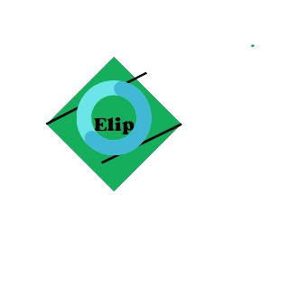

# A c++ 20 utils only headers
### Class
- Elip::String
- Elip::Vector
- Elip::Map
- Elip::File
### Functions
# Strings
- Str
- Split
# Format and Print
- Format -> wiht Color(Windows,Linux,MacOS)
- Printf ->with Format
- PrinfWithoutColor ->Prinf without color
- FormatfWithoutColor -> Format without color
# Terminal utils
- ChangeTerminalTitle -> (Windows,Linux,MacOS)
- ChangeTerminalCursorPosition -> (Windows,Linux,MacOS)
- ActivateTerminal
# Filesystem
- ExistsFS
- IsFileFS
- IsDirectoryFS
- IsSymLinkFS
- DeleteFS
- CreateDirectoryFS
- CreateSymLinkFS
- CreateFileFS
# Vector
- Join
- PrintVector
- ToVect
- ToVectStr
## How to include ?
```cpp
#include "Elip.hpp"
```

## Examples:
- Filesystem:
```cpp
#include "Elip.hpp"
int main()
{
    if (!Elip::ExistsFS("test.txt"))
    {
        Elip::Printf("{}\n", "No existe el archivo text.txt,creando el archivo");
        Elip::CreateFileFS("test.txt");
    }
    Elip::File data("test.txt");
    data.Write("Hola mundo en c++");
    Elip::Printf("Datos del archivo: {}\n", data.ReadAsString());
}
```
- Format and Printf:
```cpp
#include "Elip.hpp"
using namespace Elip;
int main()
{
    //  RED    RED   GREEN
    // hello Joaquin!!!
    ActivateTerminal();
    Printf("{FG_RED}hello {}{FG_GREEN}!!!{FG_RESET}\n", "Joaquin");
    auto result = Format("hellooooo {} {}", "C++", 17);
    Printf("{}", result);
}
```
- Strings:
```cpp
Elip::String myString("hello python hello");
myString.Replace("python", "amo");
myString.TrimLeft("hello");
Elip::Printf("{}\n",myString);
```
- More examples in examples folder
[](https://opensource.org/licenses/MIT)
